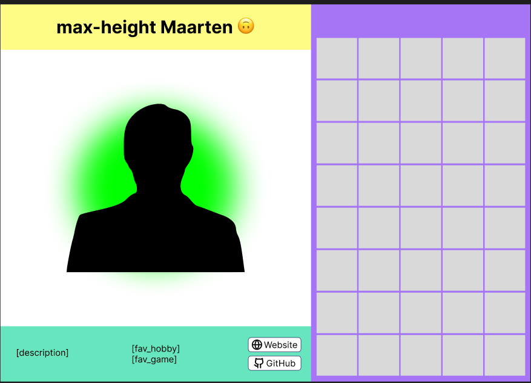
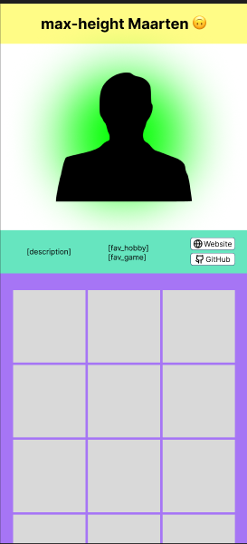
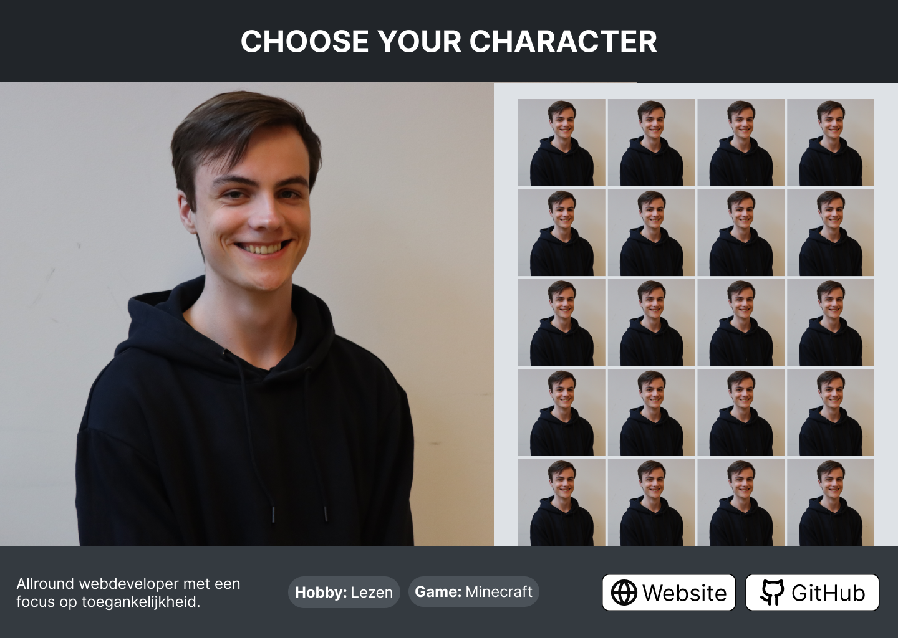
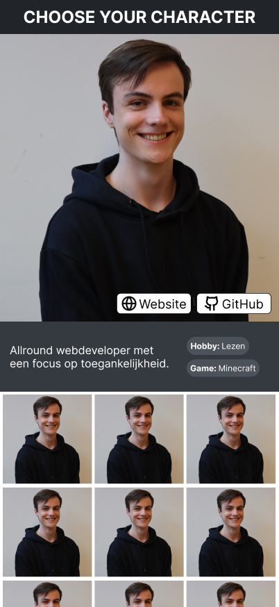

# Bogomolova Squadpage

## Inhoudsopgave

1. [Live link](#live-link)
2. [Installatie-instructies](#installatie-instructies)
3. [Beschrijving](#beschrijving)
4. [Mockups](#mockups)
5. [Gebruik](#gebruik)
6. [Bronnen](#bronnen)
7. [Designkeuzes](#designkeuzes)
8. [Kenmerkende code](#kenmerkende-code)
9. [Codeconventies](#codeconventies)
10. [Afspraken samenwerken](#afspraken-samenwerken)
11. [Licentie](#licentie)

## Live link

Bekijk [hier](https://flourishing-creponne-006d78.netlify.app/) de livesite

## Intallatie instructies

### clone

Clone dit project via git

### install

Installeer de applicatie

```sh
npm install
```

### Building

Bouw de applicatie

```sh
npm run build
```

## Beschrijving

Op deze website kan je iedereen bekijken die in FDND jaar 2 zit plus leraren. Kijk wat mensen hun hobbies zijn, hun website, github en allerbelangrijkst wat hun favorieten game is.

## Mockups

Hier kan je de eerste versies bekijken van ons project

### Early design desktop



### Early design mobile



## Gebruik

De website is eenvoudig te gebruiken selecteer iemand uit de lijst en je kunt hun informatie zien.

## Bronnen

inspiratie design
- [squadpage](https://nycsquadpage.netlify.app/characters)
- [mario kart](https://www.reddit.com/r/mariokart/comments/1jf49wz/made_another_character_select_ui_concept_some/)
- [multiversus](https://www.reddit.com/r/MultiVersus/comments/1ft7t6a/character_select_screen_ui/)

## Designkeuzes

We hebben gekozen voor een vrij minimalistisch design met iedereen in een overzicht aan de zijkant (of onderkant op mobiel). In de footer laten we dan wat informatie zien over de student met twee buttons naar hun eigen website en GitHub-profiel. Omdat we er nog niet uitkwamen met de kleuren hebben we het design met grijstinten gemaakt om later nog te beslissen over de kleuren die we wilden gebruiken. Uiteindelijk zijn we tot de kleuren van het oude design gekomen en het formaat van het nieuwste design gelaten. In dit issue zijn de verschillende versies weergegeven: [Issue #4](https://github.com/Tjeerd-JW/your-tribe-for-life-squad-page/issues/4)

### Design desktop



### Design mobile



## Kenmerkende code

Voor dit project hebben we veel gewerkt met componenten om de opbouw makkelijk te maken.

```html
<main>
  <section class="select-screen">
    <Topbar title="Choose your character" />
    <div class="detail-content">
      {@render children()}
    </div>
    <List {persons} />
  </section>
  <Details {person} />
</main>
```

## Codeconventies

Voor de codeconventies volgen wij de [fdnd code conventions](https://docs.fdnd.nl/conventies.html#code-conventies)

## Afspraken samenwerken

Bekijk [hier](CONTRIBUTING.md) onze gesamenlijke afpsraken.

## Licentie

This project is licensed under the terms of the [MIT license](./LICENSE).
